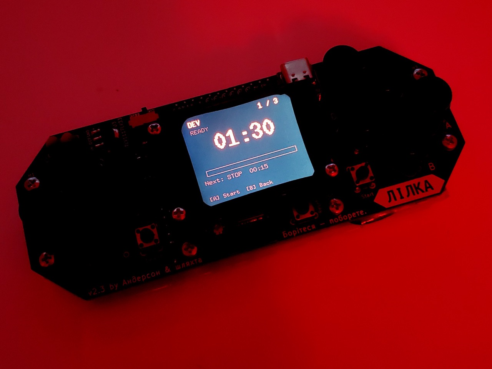

# Darkroom Timer for Lilka



Custom firmware for [Lilka](https://github.com/and3rson/lilka) — a darkroom timer for paper development.

## Features

- **3 configurable presets** with up to 10 steps each (DEV, STOP, FIX, WASH, etc.)
- **Dmax Test** — dedicated tool for determining paper development time
- **Auto-advance** between steps with audio cues
- **Sound alerts** — start, 30s marks, last 10s countdown, step transitions
- **WiFi web interface** — edit presets and settings from your phone/laptop
- **HTTP API** — control the timer remotely (Home Assistant, curl, etc.)
- **External button** — wire a tactile button to any available GPIO pin for hands-free control
- **Bilingual UI** — English / Ukrainian
- **Adjustable brightness & volume**

## Controls

| Button  | Function                     |
| ------- | ---------------------------- |
| UP/DOWN | Navigate                     |
| A       | Confirm / Start / Resume     |
| B       | Back / Pause                 |
| L/R     | Adjust values                |
| START   | Skip step / Edit preset name |
| C/D     | Add / Delete step (editor)   |

## External Button

You can wire a simple momentary button to any of the available GPIO pins (12, 13, 14, 41, 47, 48). One contact goes to GND, the other to the selected pin — no resistor needed (internal pull-up is used).

Select the pin in **Settings → Ext Btn**. While on the timer screen:

| Gesture      | Action                 |
| ------------ | ---------------------- |
| Single click | Start / Pause / Resume |
| Double click | Skip to next step      |

Useful when you want to place the button away from the device — the audio cues are enough to follow the process.

## HTTP API

When WiFi is enabled, the timer exposes a simple API:

| Endpoint                | Description            |
| ----------------------- | ---------------------- |
| `GET /api/timer`        | Current timer state    |
| `GET /api/timer/toggle` | Start → Pause → Resume |
| `GET /api/timer/next`   | Skip to next step      |

All endpoints return JSON:

```json
{ "state": "running", "step": 0, "remaining": 87, "label": "DEV" }
```

Works from a browser, curl, or Home Assistant:

```yaml
shell_command:
  timer_toggle: "curl -s http://timer.local/api/timer/toggle"
  timer_next: "curl -s http://timer.local/api/timer/next"
```

> **Tip:** Use the device's local IP address (e.g. `http://192.168.1.42`) instead of `timer.local` — mDNS resolution can add a few seconds of latency, which matters when triggering the timer precisely.

> Note: the API controls the timer engine directly. The timer must be initialized first — navigate to a preset via the on-device menu before using the API.

## Finding Development Time with Dmax Test

Dmax (maximum density) is the deepest black a given paper can produce.

**Procedure:**

1. Take a small piece of photographic paper and expose it completely — fog the entire piece under room light.
2. Start the Dmax Test on the device (the delay countdown begins — 10 seconds by default). Immediately dip just a corner of the fogged piece into the developer.
3. When the beep sounds (delay ends), submerge the whole piece. The corner has a ~10-second head start and will appear darker than the rest.
4. Watch closely as development progresses — the rest of the paper gradually catches up to the corner.
5. The moment both zones reach the same level of black, stop the timer. That is the Dmax time for this paper in this developer at this temperature.
6. Add 5–10 seconds on top as a safety margin.

This is your working development time. For most papers in popular developers (Ilford Multigrade, Kodak Dektol, etc.) it falls in the range of **60–120 seconds**.

Re-run the test whenever you change paper stock, developer brand or dilution, or temperature.

## About

100% of the code was written by [Claude](https://claude.ai) (Anthropic) via Claude Code.

---

# Darkroom Таймер на базі Lilka

Кастомна прошивка для [Lilka](https://github.com/and3rson/lilka) — таймер для даркруму.

## Можливості

- **3 пресети** — до 10 кроків кожен (DEV, STOP, FIX, WASH, тощо)
- **Dmax Тест** — інструмент для визначення часу проявки паперу
- **Автоперехід** між кроками зі звуковими сигналами
- **Звукові сповіщення** — старт, позначки 30с, останні 10с, переходи між кроками
- **WiFi веб-інтерфейс** — редагування пресетів і налаштувань з телефону/ноутбука
- **HTTP API** — керування таймером з Home Assistant, curl тощо
- **Зовнішня кнопка** — підключи тактову кнопку до будь-якого доступного піна GPIO
- **Двомовний інтерфейс** — English / Українська
- **Яскравість і гучність** — регулюються в налаштуваннях

## Керування

| Кнопка  | Функція                            |
| ------- | ---------------------------------- |
| UP/DOWN | Навігація                          |
| A       | Підтвердити / Старт / Продовжити   |
| B       | Назад / Пауза                      |
| L/R     | Змінити значення                   |
| START   | Пропустити крок / Редагувати назву |
| C/D     | Додати / Видалити крок (редактор)  |

## Зовнішня кнопка

Підключи тактову кнопку до одного з доступних пінів (12, 13, 14, 41, 47, 48): один контакт на GND, другий на обраний пін. Резистор не потрібен — використовується внутрішня підтяжка.

Вибір піна: **Налаштування → Зовн кн**. Під час роботи таймера:

| Жест           | Дія                        |
| -------------- | -------------------------- |
| Одиночний клік | Старт / Пауза / Продовжити |
| Подвійний клік | Наступний крок             |

Зручно, коли хочеш винести кнопку подалі від пристрою — звукових сигналів достатньо, щоб стежити за процесом.

## HTTP API

Коли WiFi увімкнено, таймер відкриває простий API:

| Ендпоїнт                | Опис                        |
| ----------------------- | --------------------------- |
| `GET /api/timer`        | Поточний стан таймера       |
| `GET /api/timer/toggle` | Старт → Пауза → Продовжити  |
| `GET /api/timer/next`   | Перейти до наступного кроку |

Всі ендпоїнти повертають JSON:

```json
{ "state": "running", "step": 0, "remaining": 87, "label": "DEV" }
```

Працює з браузера, curl або Home Assistant.

> **Порада:** використовуй локальний IP пристрою (наприклад `http://192.168.1.42`), а не `timer.local` — mDNS може додавати кілька секунд затримки, що критично при точному запуску таймера.

> Примітка: API керує рушієм таймера напряму — перед використанням потрібно ввійти у пресет через меню пристрою.

## Як знайти час проявки через Dmax Тест

Dmax (максимальна щільність) — це найглибший чорний колір, який конкретний папір може дати. Визначивши цей час, отримуєш правильний час проявки.

**Процедура:**

1. Візьми невеликий шматочок фотопаперу і повністю засвіти його — прямо під звичайним світлом.
2. Запусти Dmax Тест на пристрої (почнеться зворотний відлік затримки — 10 секунд за замовчуванням). Одразу окуни лише кут шматка в проявник.
3. Коли пролунає сигнал (затримка закінчилася) — вкинь весь шматок. Кут має перевагу ~10 секунд і виглядатиме темнішим за решту.
4. Уважно стежи — решта паперу поступово наздоганяє кут.
5. Як тільки обидві зони зрівняються — кут і основна частина досягнуть однакового рівня чорного — зупини таймер. Це і є час до Dmax для цього паперу в цьому проявнику при цій температурі.
6. Додай 5–10 секунд зверху як запас точності.

Це твій робочий час проявки. Для більшості паперів у популярних проявниках (Ilford Multigrade, Kodak Dektol тощо) він зазвичай у діапазоні **60–120 секунд**.

Повторюй тест при зміні паперу, проявника (марки або розведення) або температури.
